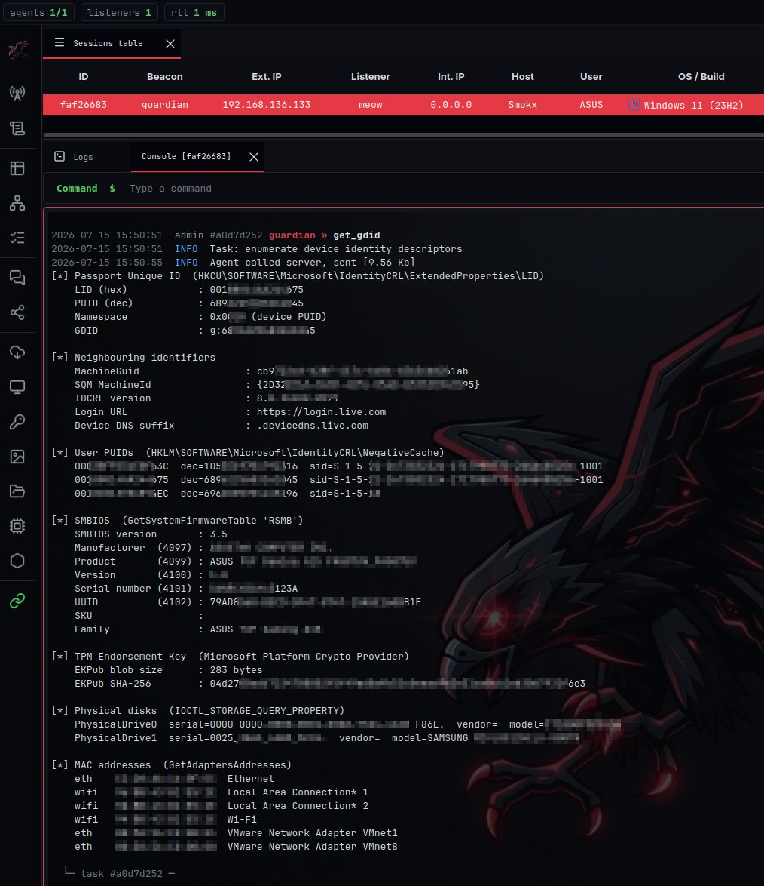

## GDID Extractor PoC

GDID Extractor PoC and demonstration in Rust / C and Bof version.

Full Research blog can be found here: https://zerotracelab.com/blog/gdid-windows-tracking  

## PoC BoF Output:- 

> Executing BoF Code. 

> Executing Rust PoC

> 

## References 

- https://github.com/SmtimesIWndr/gdid-reversal
- https://oofhours.com/2022/08/01/connect-the-dots-from-hardware-hash-to-autopilot-profile

## License 

- [MIT](./LICENSE)
